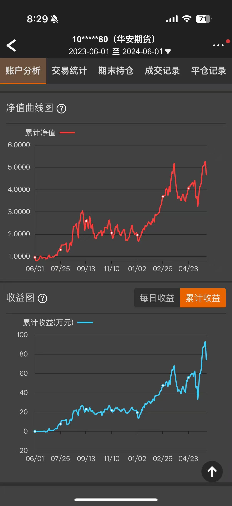

# 中国商品期货量化研究

面向中国商品期货市场的特征工程、信号构建与量化策略研究项目。

## 项目简介

本项目聚焦中国商品期货市场中的系统化交易研究，围绕因子/特征挖掘、交易信号生成、策略设计、回测评估与绩效分析展开，强调研究流程的清晰性、方法的可解释性以及策略开发的实用性。

## 研究内容

- 商品期货特征工程与因子构建
- 量化交易信号设计与筛选
- 策略回测与绩效评估
- 风险控制与稳健性分析
- 系统化交易思路研究与迭代

## 实盘结果展示

下图为本人商品期货实盘账户在 **2023-06-01 至 2024-06-01** 期间的一年交易结果截图，展示了账户净值曲线与累计收益变化。

## 项目目标

通过构建高效特征与量化策略框架，探索适用于中国商品期货市场的系统化研究方法与交易思路。

## 技术栈

- Python
- NumPy
- pandas
- SciPy
- scikit-learn

## 说明

本项目仅用于研究与学习交流，不构成任何投资建议或实际交易承诺。
